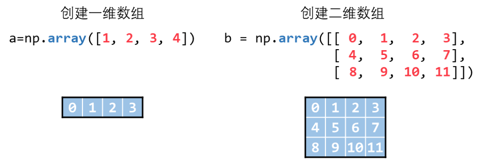
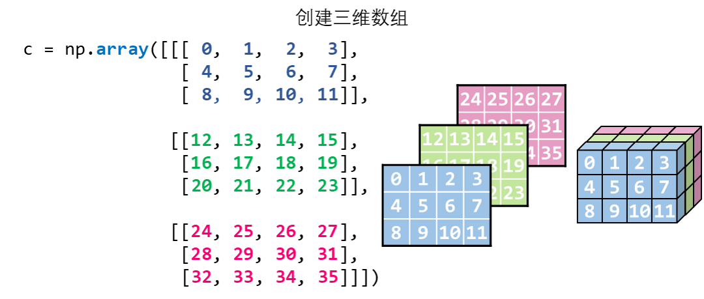
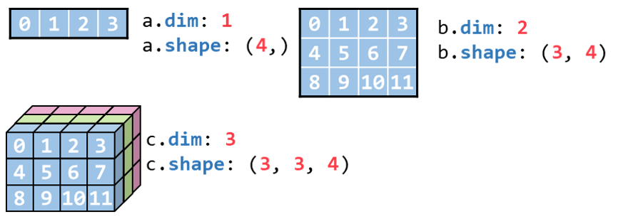
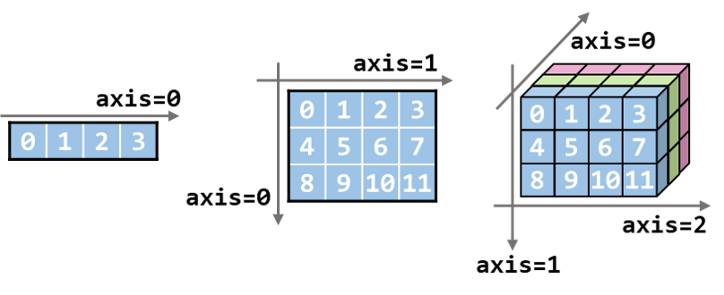
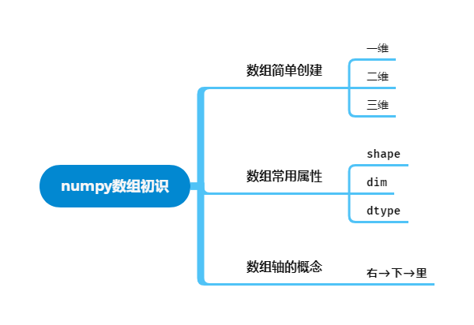

[上一章:README.md](./README.md)

# numpy数组初识

下面主要了解numpy最核心的对象——**数组**。

整个numpy都在和数组打交道。

主要介绍：
- 怎样**创建一个数组**
- **数组的常用属性**有哪些
- 简单了解之后经常用到的概念——**数组的轴**。

:bulb:希望通过代码结合图形化的方式在初学者大脑中建立起形象的numpy数组概念，让之后的学习更加丝滑顺畅。

:bulb:这是一个本篇内容基础的思维导图，在**文章结尾**会展示更完整的思维导图


```python
import numpy as np
np.__version__
```
```
'1.22.3'
```
## numpy数组简单创建

首先通过最原始的方法（**列表**）来创建数组，后续会介绍其他更简便地创建数组的方法。

下面用一、二、三维列表分别创建了三个数组。


三维数组会比二维数组复杂些，但其实三维数组的本质就是二维数组堆叠形成的，比如

**创建一维数组**
```python
a = np.array([0, 1, 2, 3])
a
```
```
array([0, 1, 2, 3])
```
**创建二维数组**
```python
b = np.array([[ 0,  1,  2,  3],
              [ 4,  5,  6,  7],
              [ 8,  9, 10, 11]])
b
```
```
array([[ 0,  1,  2,  3],
       [ 4,  5,  6,  7],
       [ 8,  9, 10, 11]])
```
**创建三维数组**
```python
c = np.array([[[ 0,  1,  2,  3],
               [ 4,  5,  6,  7],
               [ 8,  9, 10, 11]],

              [[12, 13, 14, 15],
               [16, 17, 18, 19],
               [20, 21, 22, 23]],

              [[24, 25, 26, 27],
               [28, 29, 30, 31],
               [32, 33, 34, 35]]])
c
```
```
array([[[ 0,  1,  2,  3],
        [ 4,  5,  6,  7],
        [ 8,  9, 10, 11]],

       [[12, 13, 14, 15],
        [16, 17, 18, 19],
        [20, 21, 22, 23]],

       [[24, 25, 26, 27],
        [28, 29, 30, 31],
        [32, 33, 34, 35]]])
```
## numpy数组常用属性

这一小节介绍数组的常用属性，实际使用过程中`.shape`属性是使用最多的，我个人觉得刚开始学知道这个属性就够了，但为了内容丰富一点，这里多介绍了2个属性，这三个常用属性分别为：
- `.shape`：数组的**形状**，使用频率最高
- `.ndim`：数组的**维数**，使用频率一般
- `.astype`：数组的**数据类型**，也比较常用

下面介绍这几个属性的具体含义，例如之前我们创建的三个数组：
- 一维数组`a`，**1**维，长为**4**
- 二维数组`b`，**2**维，长为**3**宽为**4**
- 三维数组`c`，**3**维，深度为**3**长为**3**宽为**4**

可以通过`ndim`属性查看**维数**，通过`shape`属性查看**形状**
```python
print('a.ndim:', a.ndim, 'a.shape:', a.shape)
print('b.ndim:', b.ndim, 'b.shape:', b.shape)
print('c.ndim:', c.ndim, 'c.shape:', c.shape)
```
```
a.ndim: 1 a.shape: (4,)
b.ndim: 2 b.shape: (3, 4)
c.ndim: 3 c.shape: (3, 3, 4)
```
通过`.dtype`属性查看数组的**数据类型**
```python
print('a.dtype:', a.dtype)
print('b.dtype:', b.dtype)
print('c.dtype:', c.dtype)
```
```
a.dtype: int32
b.dtype: int32
c.dtype: int32
```
用图像表示就是：


## numpy数组轴的概念

> 提示
>
> 这里先引入了轴的概念，一开始可以不用深究，了解有这么个东西就行，因为我一开始对这一概念也模模糊糊的。结合后面的内容会更容易了解轴的概念

轴的概念简单介绍：

可以把轴理解为第几个维度，比如之前的数组`c`的维数是三，那`axis=0`就是第一维，`axis=1`，`axis=2`分别是第二第三维。

- 在numpy中，通常用`axis=0`, `axis=1`的形式表示轴的编号。
- 数组有几维，数组就有几个轴。例如一维数组只有一个轴，二维数组就有两个轴，二维数组的轴就相当于换个名称来表示二维数组的行和列，比如`axis=0`相当于行，`axis=1`相当于列。

具体可以看下图：

**如何快速记忆不同维度的数组，每个轴都代表什么？**

比如，如何快速记忆三维数组 `axis=1` 是哪个轴？

其实很简单，记住一个口诀：**右下里**，依次递减。

解释：
- 最高维的轴朝右
- 第二个轴朝下
- 第三个轴朝里

比如上图的二维数组和三维数组，最高维的轴分别是`axis=1`和`axis=2`，都是**朝右**的。

然后二维数组和三维数组的第二维的轴，分别是`axis=0`和`axis=1`，都是**朝下**的

三维数组最后一个轴,`axis=0` 则是**朝里**的。

自然，只有一个轴的一维数组，最高维的轴是`axis=0`，也是**朝右**的

因此，只要结合好上面这张图，加上**右下里**这个口诀，就能图形化地把数组这个形象记在脑中了。

> 提示
>
>**右下里**该怎么记？
>
>自创个口诀，比如：我自**幼(右)**就喜欢**下**地**里**干活
>
>当然也可以硬记，反正只有3个字。
>
>
>**超过三维**怎么办？
>
>方法有两个：
>- 1.**无视**：别管大于三维的数组了，反正用得也不多。
>- 2.**套娃**：比如遇到四维数组，就把三维数组打包成一个小盒子，然后四维数组就相当于多个盒子排成长条，就变成一维数组了。
因为通过二层列表创建的数组就是二维数组。所以当绘图中出现单独的一列时，这也是一个二维数组。

通过二维列表创建二维数组，每个嵌套的列表只有一个元素。

```python
b2 = np.array([[0],
               [1],
               [2]])
print(b2)
```
```
[[0]
 [1]
 [2]]
```
```python
print('b2.ndim:', b2.ndim, 'b2.shape:', b2.shape)
```
```
b2.ndim: 2 b2.shape: (3, 1)
```
> 提示
>
>本文中出现的变量名的一些约定
>
>- 字母`a`, `b`, `c`, 分别表示一、二、三维数组
>- 如果出现多个一维数组，则用`a1`, `a2`, ...表示。出现多个二维、三维数组时同理
## 小结



[下一章:2.numpy数组创建](./2.numpy数组创建.md)
