[上一章:1.numpy数组初识](./1.numpy数组初识.md)
# numpy数组创建

上一小节中，创建一个长为4的1维数组要写4个数字，如果要创建一个长为100的数组，就要写100个数字，未免太麻烦了一点。

本小节，将介绍一系列十分常用且方便的数组创建方法：
- **等间隔数组**：数组两两之间间隔相同，类似等差数列。
- **全等数组**：数组里所有元素都相同。
- **随机数组**：按要求随机生成数组，做模拟的时候很有用。

```python
import numpy as np
print(np.__version__)
```
```
1.22.3
```
## 等间隔数组

以下两个函数只能创建一维数组。

- `np.arange()`: 按照给定的**步长**根据起点和终点生成一维数组
- `np.linspace()`: 按照给定的**数组长度**，均匀划分起点到终点的距离生成一维数组
### np.arange()

:book:[官方文档](https://numpy.org/doc/stable/reference/generated/numpy.arange.html)

```python
numpy.arange(start, end, step, ...)
```
`np.arange()`函数和python自带的`range()`函数十分类似。

- `start`: 起点，默认为0
- `end`: 终点
- `step`: 步长，默认为1


从起点开始，每次按步长递增生成数组，**生成的数组不包括终点**

只有一个参数时，会默认从0开始，以步长1生成数组。
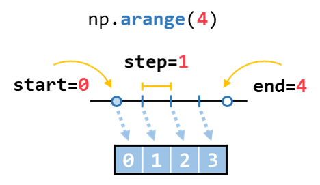
```python
a = np.arange(4)
print(a)
```
```
[0 1 2 3]
```
> 提示
>
>为了文档更加简洁，下面的代码块省略赋值后再`print`的操作。
>
>坐标轴上的空心圆表示生成的数组不包括这个点。
只有两个参数时，表示指定了起点和终点，默认以步长1生成数组。
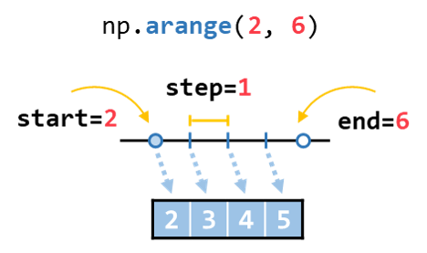
```python
np.arange(2, 6)
```
```
array([2, 3, 4, 5])
```
从2开始到9结束，步长为2
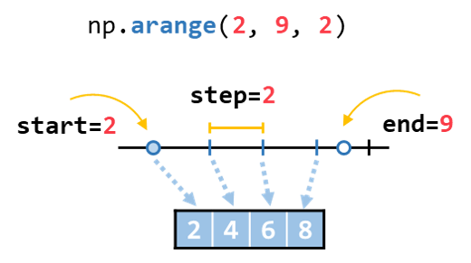
```python
np.arange(2, 9, 2)
```
```
array([2, 4, 6, 8])
```
和`range`的一大区别是`np.arange`的步长可以是小数

小数的创建规律同整数
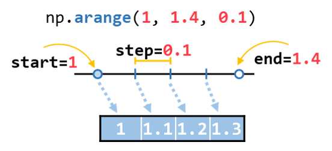
```python
np.arange(1, 1.4, 0.1)
```
```
array([1. , 1.1, 1.2, 1.3])
```
> 提示
>
>再次提醒`np.arange(start, end, step)`，这个函数生成的数组不包含`end`值
>
### np.linspace()

:book:[官方文档](https://numpy.org/doc/stable/reference/generated/numpy.linspace.html)

```python
numpy.linspace(start, end, num=50, ...)
```

- `start`: 起点
- `end`: 终点
- `num`: 一维数组长度

根据起点和终点生成间隔相同的一维数组，**生成的数组包括终点**，数组长度为`num`

下面以1作为起点，4作为终点，尝试不同的`num`以了解`np.linspace`的使用
`num=5`时，生成的数组长度为5，生成的数组包含了起点1和终点4，且前后两个元素的间隔相等
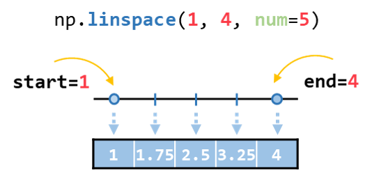
```python
np.linspace(1, 4, num=5)
```
```
array([1.  , 1.75, 2.5 , 3.25, 4.  ])
```
`num=4`时
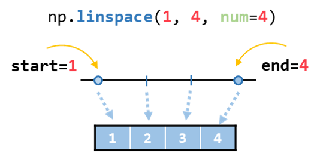
```python
np.linspace(1, 4, num=4)
```
```
array([1., 2., 3., 4.])
```
`num=3`时
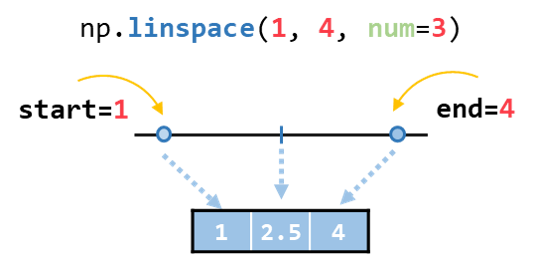
```python
np.linspace(1, 4, num=3)
```
```
array([1. , 2.5, 4. ])
```
`num=2`时，生成的数组恰好是由起点和终点组成的
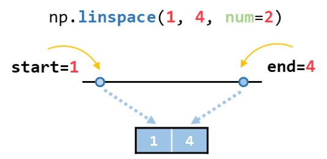
```python
np.linspace(1, 4, num=2)
```
```
array([1., 4.])
```
`num=1`时，生成了一个只有起点的数组
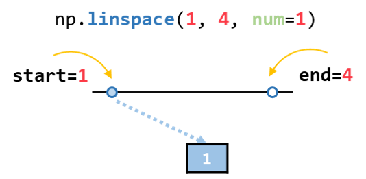
```python
np.linspace(1, 4, num=1)
```
```
array([1.])
```
## 全等数组

以下3个函数创建的数组，所有数组元素均相等

- `np.zeros()`: 生成一个全为0的一维或多维数组。
- `np.ones()`: 生成一个全为1的一维或多维数组。
- `np.full()`: 生成一个元素全部相等的一维或多维数组。
### np.zeros()

:book:[官方文档](https://numpy.org/doc/stable/reference/generated/numpy.zeros.html)

```python
numpy.zeros(shape, ...)
```

生成一个全为0的数组，使用频率也是很高的一个函数
生成一个全为0的一维数组
```python
np.zeros(shape=4)
```
```
array([0., 0., 0., 0.])
```
生成一个全为0的二维数组
```python
np.zeros(shape=(3, 4))
```
```
array([[0., 0., 0., 0.],
       [0., 0., 0., 0.],
       [0., 0., 0., 0.]])
```
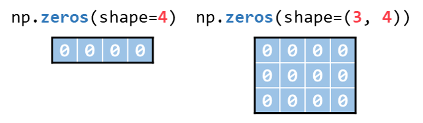
### np.ones()

:book:[官方文档](https://numpy.org/doc/stable/reference/generated/numpy.ones.html)

```python
numpy.ones(shape, ...)
```

生成一个全为1的数组，与`np.zeros()`类似
生成一个全为1的一维数组
```python
np.ones(shape=4)
```
```
array([1., 1., 1., 1.])
```
生成一个全为1的二维数组
```python
np.ones(shape=(3, 4))
```
```
array([[1., 1., 1., 1.],
       [1., 1., 1., 1.],
       [1., 1., 1., 1.]])
```
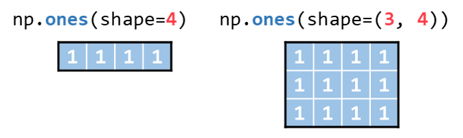
### np.full()

:book:[官方文档](https://numpy.org/doc/stable/reference/generated/numpy.full.html)

```python
numpy.full(shape, fill_value, ...)
```

生成一个全为某个数的数组，这个数也可以是字符型的。

- shape: 数组的形状
- fill_value: 数组的值
生成一个全为2.4的一维数组
```python
np.full(shape=4, fill_value=2.4)
```
```
array([2.4, 2.4, 2.4, 2.4])
```
生成一个全为`"a"`的二维数组
```python
np.full(shape=(3, 4), fill_value='a')
```
```
array([['a', 'a', 'a', 'a'],
       ['a', 'a', 'a', 'a'],
       ['a', 'a', 'a', 'a']], dtype='<U1')
```
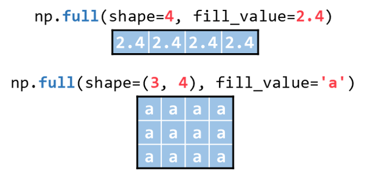
## 随机数组

下面介绍5个常用的随机数组创建函数

- `np.random.random()`: 生成一个**0到1之间**均匀分布的随机数组
- `np.random.uniform()`: 生成一个**指定区间**均匀分布的随机数组
- `np.random.randn()`: 生成一个**标准**正态分布的的随机数组
- `np.random.normal()`: 生成一个**指定**正态分布的的随机数组
- `np.random.randint()`: 生成一个指定区间范围的随机整数数组
### np.random.random()

:book:[官方文档](https://numpy.org/doc/stable/reference/random/generated/numpy.random.random.html)

```python
numpy.random.random(size)
```

生成一个0到1之间的随机数组

- size: 数组的形状

生成一个0到1之间的1维随机数组
```python
np.random.random(4)
```
```
array([0.9155639 , 0.0879231 , 0.50418975, 0.79625964])
```
生成一个0到1之间的2维随机数组
```python
np.random.random((3, 4))
```
```
array([[0.29551936, 0.42407484, 0.65833207, 0.54675449],
       [0.64280259, 0.42581316, 0.12087349, 0.72347867],
       [0.36625864, 0.71585893, 0.24240265, 0.90152112]])
```
### np.random.uniform()

:book:[官方文档](https://numpy.org/doc/stable/reference/random/generated/numpy.random.uniform.html)

```python
numpy.random.uniform(low=0.0, high=1.0, size=None)
```

生成一个范围是`low`到`high`之间的随机数组

- `low`: 数组的最小值
- `high`: 数组的最大值
- `size`: 数组的形状

> 其实跟`np.random.random()`类似，就是多了控制范围的2个参数。
生成一个2到5之间的1维随机数组
```python
np.random.uniform(low=2, high=5, size=4)
```
```
array([4.46704977, 3.28453679, 3.8914482 , 4.23255661])
```
生成一个-3到3之间的2维随机数组
```python
np.random.uniform(-3, 3, (3, 4))
```
```
array([[ 0.53919671,  2.70351516,  1.91513643, -0.0198369 ],
       [ 2.43241932, -2.99126798, -2.1072604 , -1.95992406],
       [ 2.23506767, -2.32354201,  1.18681695, -0.09019135]])
```
### np.random.randn()

:book:[官方文档](https://numpy.org/doc/stable/reference/random/generated/numpy.random.randn.html)

```python
numpy.random.randn(d0, d1, d2, ...)
```

生成一个均值为0方差为1的标准正态分布随机数组

- `d0, d1, ...`: 数组的形状
生成一个1维标准正态分布随机数组
```python
np.random.randn(4)
```
```
array([-0.97841294,  0.08917692,  0.05429765,  0.38660857])
```
生成一个2维标准正态分布随机数组
```python
np.random.randn(3, 4)
```
```
array([[ 1.64886552,  0.36417621,  0.77745513, -1.14481688],
       [-1.0317714 , -0.13213342, -0.38355106, -1.09655604],
       [ 1.5982574 ,  0.10802592, -1.94052385,  1.07061462]])
```
### np.random.normal()

:book:[官方文档](https://numpy.org/doc/stable/reference/random/generated/numpy.random.normal.html)

```python
numpy.random.normal(loc=0.0, scale=1.0, size=None)
```

生成一个均值为`loc`标准差为`scale`的正态分布随机数组

- `loc`: 数组的均值
- `scale`: 数组的标准差
- `size`: 数组的形状
生成一个均值为2，标准差为10的一维正态分布随机数组
```python
np.random.normal(loc=2, scale=10, size=4)
```
```
array([ 11.44176805, -18.58578423,  -0.1879512 ,  10.43410251])
```
生成一个均值为-5，标准差为5的二维正态分布随机数组
```python
np.random.normal(-5, 5, size=(3, 4))
```
```
array([[  0.78720712,  -1.01289235,  -2.97885233,   0.42613163],
       [ -6.00490185,  -0.71370871,   0.1223361 ,  -9.68017774],
       [ -3.09613496, -10.65665833,  -3.89814507,  -0.69998495]])
```
### np.random.randint()

:book:[官方文档](https://numpy.org/doc/stable/reference/random/generated/numpy.random.randint.html)

```python
numpy.random.randint(low, high=None, size=None, ...)
```

生成一个指定区间`[low, high)`内的随机整数数组，**不包含最大值**

- `low`: 最小值
- `high`: 最大值，如果`high=None`，那默认生成的范围是`[0, low)`。否则生成的范围是`[low, high)`
- `size`: 数组的形状
生成一个0到5(不包含5)之间的随机一维整数数组
```python
# np.random.randint(0, 5, 8)  # 效果同下
np.random.randint(5, size=8)
```
```
array([0, 1, 3, 4, 3, 0, 2, 2])
```
生成一个1到8(不包含8)之间的随机二维整数数组
```python
np.random.randint(1, 8, (3, 4))
```
```
array([[2, 6, 7, 4],
       [3, 2, 5, 2],
       [3, 4, 1, 4]])
```
## 小结

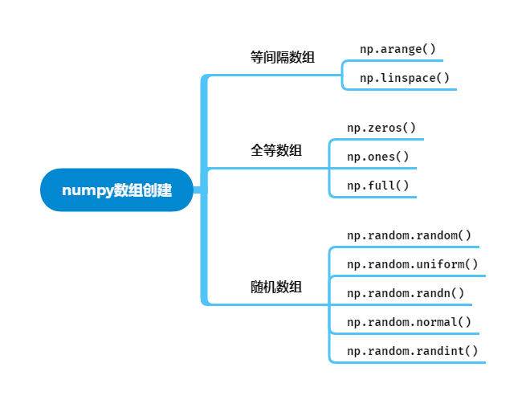

[下一章:3.numpy数组操作](./3.numpy数组操作.md)
