# numpy数组操作

主要包含

数组形变
- `ndarray.reshape()`: 可以改变数组的形状，一维变二维，二维变一维等等
- `ndarray.T`: 数组转置
- `ndarray.ravel()`: 拉直数组，多维数组变成一维

>提示
>
>`ndarray`表示某个数组对象，比如之前创建的`a=np.array([0, 1, 2, 3])`
>
>数组`a`就是一个`ndarray`对象，它可以执行`a.reshape(...)`或`a.T`等操作

数组拼接
- `np.concatenate()`: 数组拼接，可以选择特定的轴进行数组拼接
- `np.hstack()`: 数组横向拼接
- `np.vstack()`: 数组纵向拼接

数组拆分
- `np.hsplit()`: 数组横向拆分
- `np.vsplit()`: 数组纵向拆分


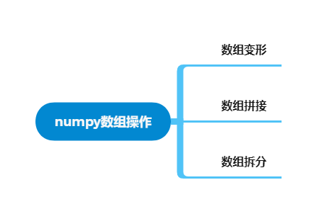
```python
import numpy as np
print(np.__version__)
```
```
1.22.3
```
## 数组形变

改变数组的形状，数组的`.shape`属性会发生变化

- `ndarray.reshape()`: 改变数组的形状
- `ndarray.T`: 数组转置
- `ndarray.ravel()`: 拉直数组
### ndarray.reshape()
:book:[官方文档](https://numpy.org/doc/stable/reference/generated/numpy.ndarray.reshape.html#numpy.ndarray.reshape)

```python
numpy.reshape(shape)
```

可以改变数组的形状，一维变二维，二维变一维等等。具体用法如下
一维数组变二维数组
```python
a = np.array([0, 1, 2, 3])
a.reshape(2, 2)
```
```
array([[0, 1],
       [2, 3]])
```
`shape`参数也可以用`-1`表示自动计算应该填的数值，最多只能有一个位置使用`-1`
```python
a.reshape((-1, 2))  # 同a.reshape((2, 2))
```
```
array([[0, 1],
       [2, 3]])
```
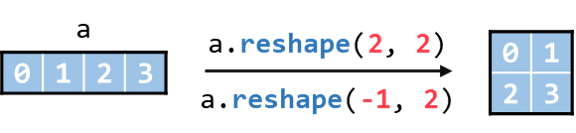
二维数组变一维数组
```python
b = np.array([[0, 1],
              [2, 3]])
b.reshape(4)
```
```
array([0, 1, 2, 3])
```
```python
b.reshape(-1)
```
```
array([0, 1, 2, 3])
```
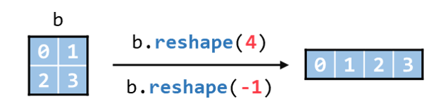
使用`np.arange()`加`reshape()`的方式可以比[numpy数组初识](./基础_numpy数组初识.md)一节中更方便地创建数组

快速创建二维数组
```python
np.arange(12).reshape(3, 4)
```
```
array([[ 0,  1,  2,  3],
       [ 4,  5,  6,  7],
       [ 8,  9, 10, 11]])
```
也可以便捷地生成三维数组
```python
np.arange(36).reshape(3, 3, 4)
```
```
array([[[ 0,  1,  2,  3],
        [ 4,  5,  6,  7],
        [ 8,  9, 10, 11]],

       [[12, 13, 14, 15],
        [16, 17, 18, 19],
        [20, 21, 22, 23]],

       [[24, 25, 26, 27],
        [28, 29, 30, 31],
        [32, 33, 34, 35]]])
```
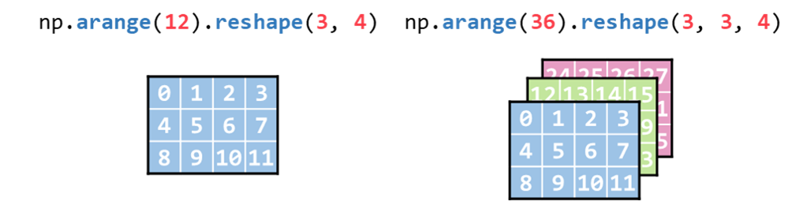
### ndarray.T
:book:[官方文档](https://numpy.org/doc/stable/reference/generated/numpy.ndarray.T.html)

数组转置，线性代数中经常使用。不过对一维数组没有效果，一般多用于二维数组
```python
a = np.arange(4)
a
```
```
array([0, 1, 2, 3])
```
```python
a.T
```
```
array([0, 1, 2, 3])
```
```python
b = np.arange(6).reshape(2, 3)
b
```
```
array([[0, 1, 2],
       [3, 4, 5]])
```
```python
b.T
```
```
array([[0, 3],
       [1, 4],
       [2, 5]])
```
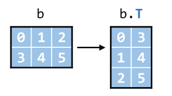
### ndarray.ravel()
:book:[官方文档](https://numpy.org/doc/stable/reference/generated/numpy.ndarray.ravel.html)

```python
numpy.ravel()
```

可以将多维数组拉平成一维数组
二维数组拉成一维数组
```python
b = np.arange(6).reshape(2, 3)
b
```
```
array([[0, 1, 2],
       [3, 4, 5]])
```
```python
b.ravel()
```
```
array([0, 1, 2, 3, 4, 5])
```
三维数组拉成一维数组
```python
c = np.arange(12).reshape(2, 2, 3)
c
```
```
array([[[ 0,  1,  2],
        [ 3,  4,  5]],

       [[ 6,  7,  8],
        [ 9, 10, 11]]])
```
```python
c.ravel()
```
```
array([ 0,  1,  2,  3,  4,  5,  6,  7,  8,  9, 10, 11])
```
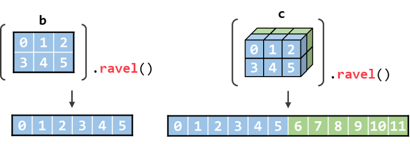
## 数组拼接

将多个相同维度的数组拼接起来

- `np.concatenate()`: 数组拼接，可以选择特定的轴进行数组拼接
- `np.hstack()`: 数组横向拼接
- `np.vstack()`: 数组纵向拼接
### np.concatenate()
:book:[官方文档](https://numpy.org/doc/stable/reference/generated/numpy.concatenate.html)

```python
numpy.concatenate((a1, a2, ...), axis=0, ...)
```

数组拼接

- `(a1, a2, ...)`: 要拼接的多个数组，用`()`或`[]`包起来再传给`np.concatenate`
- `axis`: 沿哪个轴拼接，默认沿`axis=0`的方向拼接数组，一维数组只能沿`axis=0`的方向拼接，二维数组可以沿`axis=0`或`axis=1`的方向拼接，以此类推

> 回忆之前的**右下里，依次递减**原则
>
> 如果是二维数组：
> - 最高维是`axis=1`，方向**向右**。
> - 第二维是`axis=0`，方向**向下**。
>
> 如果是三维数组：
> - 最高维是`axis=2`，方向**向右**。
> - 第二维是`axis=1`，方向**向下**。
> - 第三维是`axis=0`，方向**向里**。

> 注意
>
>`np.concatenate`、`np.hstack()`、`np.vstack`均**只能在维度相同的数组之间进行拼接**
>
>比如一维数组和一维数组拼接，二维数组和二维数组拼接
>
>**不能用一维数组和二维数组拼接**。
拼接多个一维数组，默认是沿`axis=0`的方向拼接数组

一维数组的话就是向右拼接
```python
a1 = np.array([0, 1])
a2 = np.array([2, 3, 4])
a3 = np.array([5])

np.concatenate((a1, a2, a3))
```
```
array([0, 1, 2, 3, 4, 5])
```
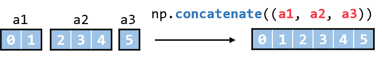
沿`axis=0`拼接二维数组，**方向向下**
```python
b1 = np.arange(6).reshape(2, 3)
b2 = np.arange(6, 12).reshape(2, 3)
```
```python
b1
```
```
array([[0, 1, 2],
       [3, 4, 5]])
```
```python
b2
```
```
array([[ 6,  7,  8],
       [ 9, 10, 11]])
```
```python
np.concatenate((b1, b2))
```
```
array([[ 0,  1,  2],
       [ 3,  4,  5],
       [ 6,  7,  8],
       [ 9, 10, 11]])
```
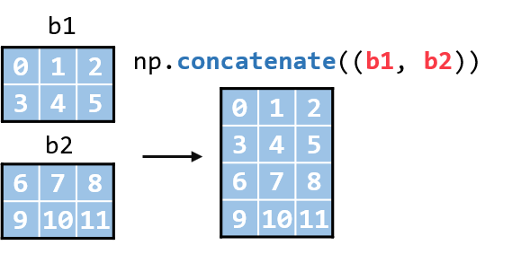
沿`axis=1`拼接二维数组
```python
np.concatenate((b1, b2), axis=1)
```
```
array([[ 0,  1,  2,  6,  7,  8],
       [ 3,  4,  5,  9, 10, 11]])
```
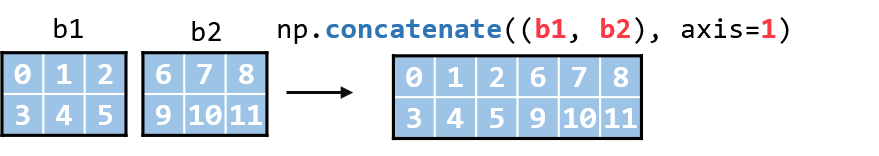
沿`axis=0`拼接三维数组，**方向向里**
```python
c1 = np.arange(8).reshape(2,2,2)
c2 = np.arange(8, 16).reshape(2,2,2)
```
```python
c1
```
```
array([[[0, 1],
        [2, 3]],

       [[4, 5],
        [6, 7]]])
```
```python
c2
```
```
array([[[ 8,  9],
        [10, 11]],

       [[12, 13],
        [14, 15]]])
```
```python
np.concatenate((c1, c2))
```
```
array([[[ 0,  1],
        [ 2,  3]],

       [[ 4,  5],
        [ 6,  7]],

       [[ 8,  9],
        [10, 11]],

       [[12, 13],
        [14, 15]]])
```
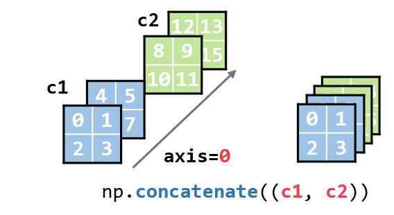
沿`axis=1`拼接三维数组，**方向向下**
```python
np.concatenate((c1, c2), axis=1)
```
```
array([[[ 0,  1],
        [ 2,  3],
        [ 8,  9],
        [10, 11]],

       [[ 4,  5],
        [ 6,  7],
        [12, 13],
        [14, 15]]])
```
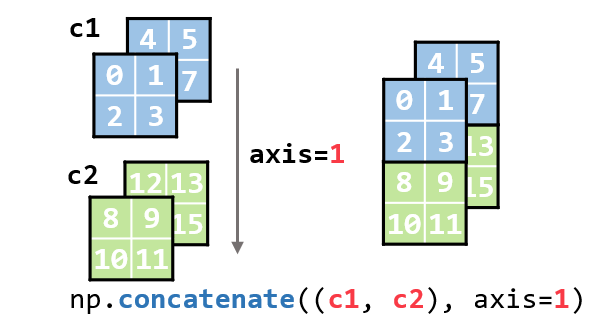
沿`axis=2`拼接三维数组，**方向向右**
```python
np.concatenate((c1, c2), axis=2)
```
```
array([[[ 0,  1,  8,  9],
        [ 2,  3, 10, 11]],

       [[ 4,  5, 12, 13],
        [ 6,  7, 14, 15]]])
```
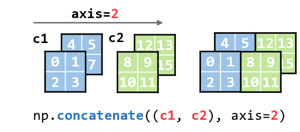
### np.hstack()
:book:[官方文档](https://numpy.org/doc/stable/reference/generated/numpy.hstack.html)

```python
numpy.hstack((a1, a2, ...))
```

数组拼接

- `(a1, a2, ...)`: 要拼接的多个数组

其实这个跟`np.concatenate()`类似，只是该方法不能选择拼接哪个轴。

hstack的完整版就是: Stack arrays in sequence horizontally

翻译一下就是沿水平方向（横向）拼接数组。

>注意
>
>个人建议**只在一、二维数组拼接的时候应用这个函数**。
>
>展现的效果和该方法字面意义一致。
一维数组横向拼接，与直接使用`np.concatenate()`的效果一致
```python
a1 = np.array([0, 1])
a2 = np.array([2, 3, 4])
a3 = np.array([5])

np.hstack((a1, a2, a3))
```
```
array([0, 1, 2, 3, 4, 5])
```
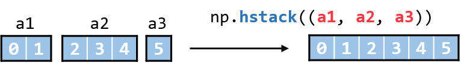
二维数组拼接，效果与`np.concatenate()`沿`axis=1`拼接数组时一致
```python
b1 = np.arange(6).reshape(2, 3)
b2 = np.arange(6, 12).reshape(2, 3)

np.hstack((b1, b2))
```
```
array([[ 0,  1,  2,  6,  7,  8],
       [ 3,  4,  5,  9, 10, 11]])
```
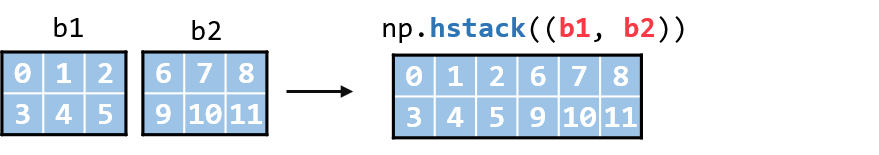
三维数组拼接，效果与`np.concatenate()`沿`axis=1`拼接数组时一致

但是不符合函数名横向拼接的含义。

所以不建议`np.hstack`在三维数组使用

可以把该函数理解为：
- 始终沿`axis=1`的方向拼接数组
- 如果是一维数组，就沿`axis=0`的方向拼接
```python
c1 = np.arange(8).reshape(2,2,2)
c2 = np.arange(8, 16).reshape(2,2,2)

np.hstack((c1, c2))
```
```
array([[[ 0,  1],
        [ 2,  3],
        [ 8,  9],
        [10, 11]],

       [[ 4,  5],
        [ 6,  7],
        [12, 13],
        [14, 15]]])
```
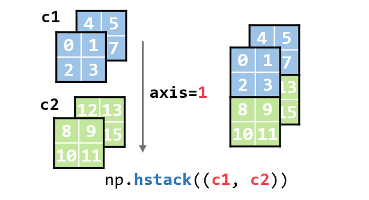
### np.vstack()
:book:[官方文档](https://numpy.org/doc/stable/reference/generated/numpy.vstack.html)

```python
numpy.vstack((a1, a2, ...))
```

数组拼接

- `(a1, a2, ...)`: 要拼接的多个数组

**纵向**拼接数组，分别以一维、二维、三维数组举例。

一维数组拼接

> 提示
>
>`np.vstack`与`np.concatenate`和`np.hstack`的差异：
>- 用`np.vstack`拼接一维数组输出的结果是一个二维数组。而用`np.concatenate`或`np.hstack`拼接一维数组输出的结果还是一维数组
>- `np.vstack`只能拼接**长度相同**的一维数组
>
>同样：建议只在一、二维数组上使用`np.vstack`
```python
a1 = np.array([0, 1])
a2 = np.array([2, 3])
a3 = np.array([4, 5])

np.vstack((a1, a2, a3))
```
```
array([[0, 1],
       [2, 3],
       [4, 5]])
```
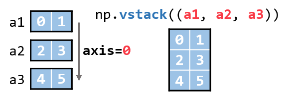
二维数组拼接，输出与`np.concatenate()`沿`axis=0`拼接数组时一致
```python
b1 = np.arange(6).reshape(2, 3)
b2 = np.arange(6, 12).reshape(2, 3)

np.vstack((b1, b2))
```
```
array([[ 0,  1,  2],
       [ 3,  4,  5],
       [ 6,  7,  8],
       [ 9, 10, 11]])
```
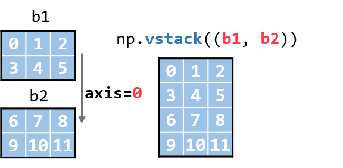
三维数组拼接，输出与`np.concatenate()`沿`axis=0`拼接数组时一致
```python
c1 = np.arange(8).reshape(2,2,2)
c2 = np.arange(8, 16).reshape(2,2,2)

np.vstack((c1, c2))
```
```
array([[[ 0,  1],
        [ 2,  3]],

       [[ 4,  5],
        [ 6,  7]],

       [[ 8,  9],
        [10, 11]],

       [[12, 13],
        [14, 15]]])
```
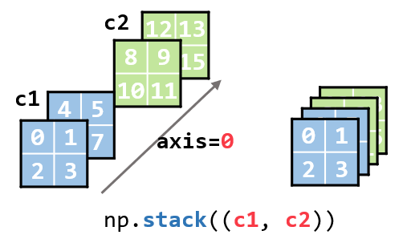
### 小结

- `np.concatenate`可以沿数组不同的方向进行拼接。
- `np.hstack`对于二维及以上的数组，总是沿着`axis=1`的方向进行拼接。
- `np.vstack`对于二维及以上的数组，总是沿着`axis=0`的方向进行拼接。
- `np.vstack`只能拼接长度相同的一维数组。
- `np.vstack`拼接一维数组后输出的结果是一个二维数组
## 数组拆分

数组拼接的反向操作

- `np.hsplit()`: 数组横向拆分
- `np.vsplit()`: 数组纵向拆分

### np.hsplit()
:book:[官方文档](https://numpy.org/doc/stable/reference/generated/numpy.hsplit.html)

```python
numpy.hspilt(ary, indices_or_sections)
```

按列拆分数组（始终按`axis=1`的方向拆分数组，当数组是二维数组时，`axis=1`就表示列）

- `ary`: 要拆分的数组
- `indices_or_sections`: 拆分方式，如果传入整数。就会均匀拆分，比如一个n行6列的数组，`indices_or_sections=2`时会把数组拆分成两个n行3列的新数组，`indices_or_sectioons=3`时会拆分成3个n行2列的新数组。

>提示
>
>也可以采用非均匀的拆分方式，基础教程暂不涉及。
拆分一维数组
```python
a = np.arange(4)
a
```
```
array([0, 1, 2, 3])
```
```python
np.hsplit(a, 2)
```
```
[array([0, 1]), array([2, 3])]
```
拆分二维数组
```python
b = np.arange(12).reshape(3, 4)
b
```
```
array([[ 0,  1,  2,  3],
       [ 4,  5,  6,  7],
       [ 8,  9, 10, 11]])
```
```python
b1, b2 = np.hsplit(b, 2)
```
```python
b1
```
```
array([[0, 1],
       [4, 5],
       [8, 9]])
```
```python
b2
```
```
array([[ 2,  3],
       [ 6,  7],
       [10, 11]])
```
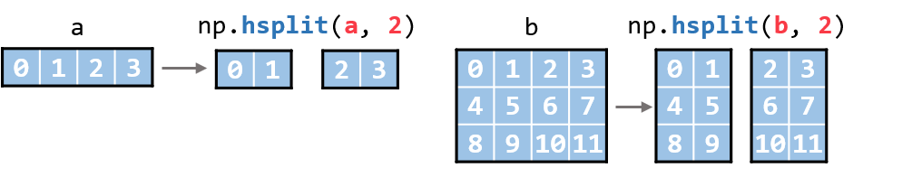
### np.vsplit()
:book:[官方文档](https://numpy.org/doc/stable/reference/generated/numpy.vsplit.html)

```python
numpy.vspilt(ary, indices_or_sections)
```

按行拆分数组（始终按`axis=0`的方向拆分数组，当数组是二维数组时，`axis=0`就表示行）

- `ary`: 要拆分的数组
- `indices_or_sections`: 拆分方式，如果传入整数。就会均匀拆分，比如一个6行m列的数组，`indices_or_sections=2`时会把数组拆分成两个3行m列的新数组，`indices_or_sectioons=3`时会拆分成3个2行m列的新数组。
>注意
>
>`np.vsplit`无法拆分一维数组
拆分二维数组
```python
b = np.arange(12).reshape(6, 2)
b
```
```
array([[ 0,  1],
       [ 2,  3],
       [ 4,  5],
       [ 6,  7],
       [ 8,  9],
       [10, 11]])
```
```python
b1, b2 = np.vsplit(b, 2)
b1
```
```
array([[0, 1],
       [2, 3],
       [4, 5]])
```
```python
b2
```
```
array([[ 6,  7],
       [ 8,  9],
       [10, 11]])
```
```python
b1, b2, b3 = np.vsplit(b, 3)
b1
```
```
array([[0, 1],
       [2, 3]])
```
```python
b2
```
```
array([[4, 5],
       [6, 7]])
```
```python
b3
```
```
array([[ 8,  9],
       [10, 11]])
```
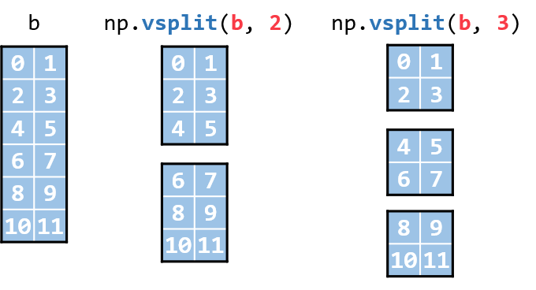
## 小结

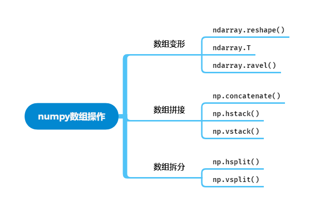
