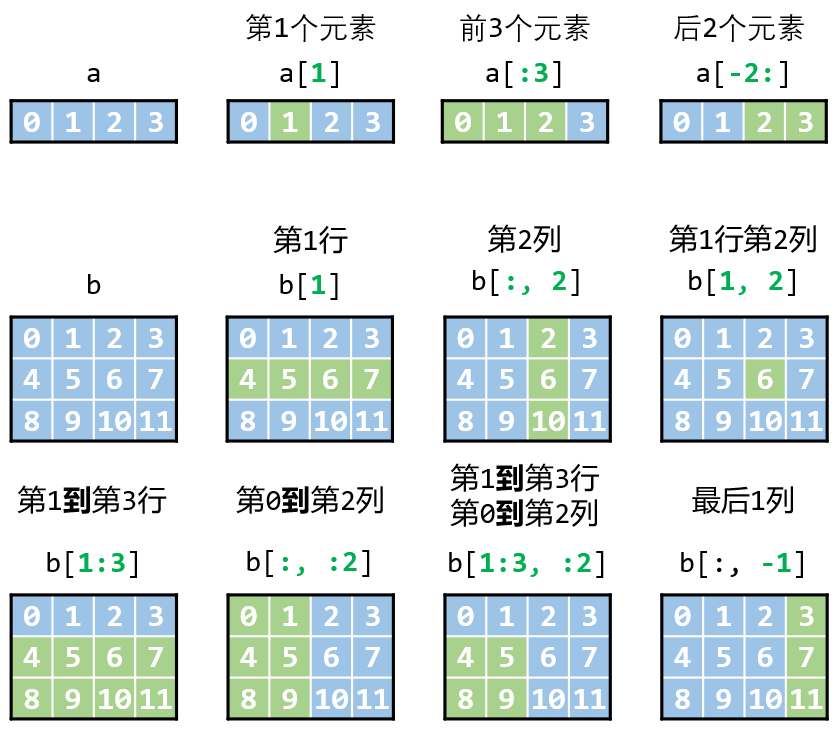
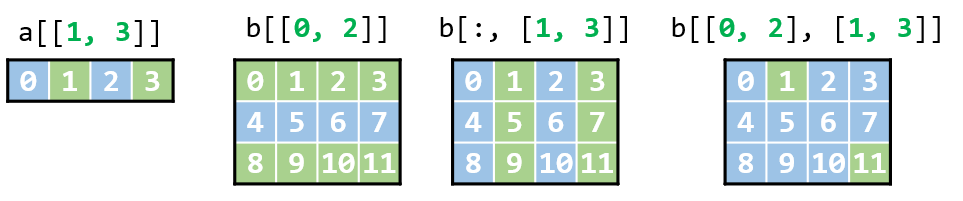
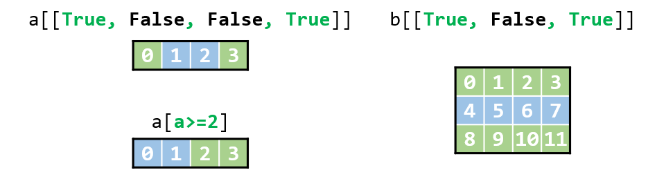

[上一章:3.numpy数组操作](./3.numpy数组操作.md)

# numpy数组索引

介绍通过如何通过以下三种方法提取数组元素：
- 基本索引与切片
- 花式索引
- 布尔索引

## 基本索引与切片
基本的索引和切片比较简单，与python list的索引方式类似。
### 一维数组
```python
import numpy as np
print(np.__version__)
```
```
1.21.5
```
```python
a = np.array([0, 1, 2, 3])
```
第1个元素
```python
a[1]
```
```
1
```
前3个元素
```python
a[:3]
```
```
array([0, 1, 2])
```
后2个元素
```python
a[-2:]
```
```
array([2, 3])
```
### 二维数组
```python
b = np.array([[ 0,  1,  2,  3],
              [ 4,  5,  6,  7],
              [ 8,  9, 10, 11]])
```
第1行
```python
b[1]
```
```
array([4, 5, 6, 7])
```
第2列
```python
b[:, 2]
```
```
array([ 2,  6, 10])
```
第1行第2列
```python
b[1, 2]
```
```
6
```
第1到第3行
```python
b[1:3]
```
```
array([[ 4,  5,  6,  7],
       [ 8,  9, 10, 11]])
```
第0到第2列
```python
b[:, :2]
```
```
array([[0, 1],
       [4, 5],
       [8, 9]])
```
第1到第3行，且也是第0到第2列
```python
b[1:3, :2]
```
```
array([[4, 5],
       [8, 9]])
```
最后1行
```python
b[:, -1]
```
```
array([ 3,  7, 11])
```

## 花式索引

花式索引的特点是可以提取不连续的元素
```python
a = np.arange(4)
a
```
```
array([0, 1, 2, 3])
```
提取a的第1和第3个元素
```python
a[[1, 3]]
```
```
array([1, 3])
```
```python
b = np.arange(12).reshape(3, 4)
b
```
```
array([[ 0,  1,  2,  3],
       [ 4,  5,  6,  7],
       [ 8,  9, 10, 11]])
```
提取b的第0和第2行
```python
b[[0, 2]]
```
```
array([[ 0,  1,  2,  3],
       [ 8,  9, 10, 11]])
```
提取b的第1和第3列
```python
b[:, [1, 3]]
```
```
array([[ 1,  3],
       [ 5,  7],
       [ 9, 11]])
```
提取b在第0行第1列和第2行第3列的两个元素

相当于同时提取`b[0, 1]`和`b[2, 3]`
```python
b[[0, 2], [1, 3]]
```
```
array([ 1, 11])
```

## 布尔索引

通过提供一个布尔数组来提取元素，通常会结合`>`、`<`、`==`等运算符计算出布尔数组然后根据布尔数组提取元素
```python
a = np.arange(4)
a
```
```
array([0, 1, 2, 3])
```
用布尔索引提取数组a的第1和第3个元素
```python
a[[True, False, False, True]]
```
```
array([0, 3])
```
提取数组a大于等于2的数
```python
# 计算出布尔数组
a >= 2
```
```
array([False, False,  True,  True])
```
```python
# 根据布尔数组提取数
a[a>=2]
```
```
array([2, 3])
```
用布尔索引提取数组b的第0和第2行
```python
b[[True, False, True]]
```
```
array([[ 0,  1,  2,  3],
       [ 8,  9, 10, 11]])
```

## 小结


[下一章:5.numpy数组运算](./5.numpy数组运算.md)
