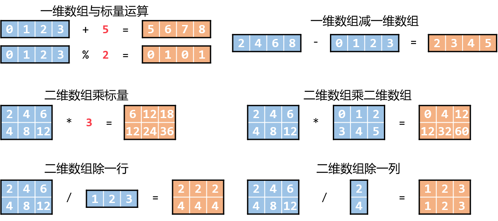
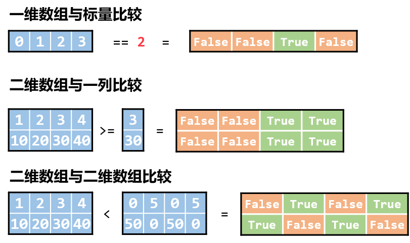
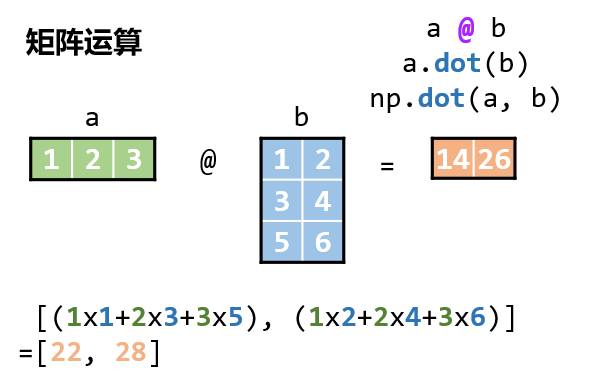
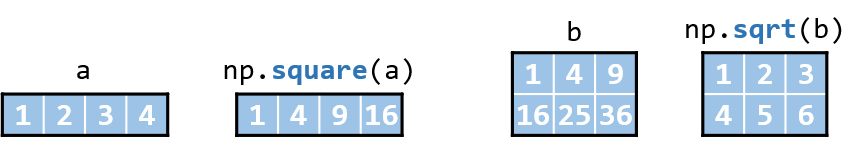
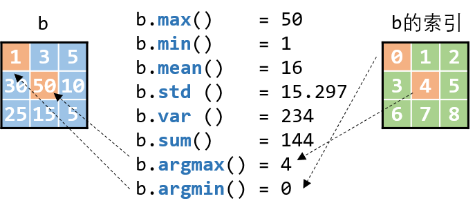
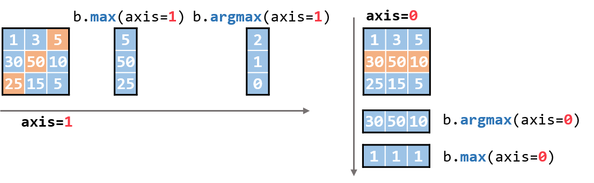

# numpy数组运算

```python
import numpy as np
print(np.__version__)
```
```
1.22.3
```
## 基本运算

四则运算：(`+-*/`)
以及求模(`%`)、取整(`//`) 、乘方(`**`)

比较运算：`==`, `!=`, `>`, `<`, `>=`, `<=`

矩阵乘法：`@`

### 四则运算
一维数组与标量相加
```python
a = np.array([0, 1, 2, 3])
a + 5
```
```
array([5, 6, 7, 8])
```
一维数组求模
```python
a % 2
```
```
array([0, 1, 0, 1], dtype=int32)
```
两个长度相同的一维数组相减
```python
a2 = np.array([2, 4, 6, 8])
a2 - a
```
```
array([2, 3, 4, 5])
```
二维数组与标量相乘
```python
b = np.array([[ 2, 4,  6],
              [ 4, 8, 12]])
b * 3
```
```
array([[ 6, 12, 18],
       [12, 24, 36]])
```
两个形状相同的二维数组相乘
```python
b2 = np.array([[0, 1, 2],
               [3, 4, 5]])
b * b2
```
```
array([[ 0,  4, 12],
       [12, 32, 60]])
```
二维数组除一行
```python
a3 = np.array([1, 2, 3])
b / a3
```
```
array([[2., 2., 2.],
       [4., 4., 4.]])
```
二维数组除一列
```python
b3 = np.array([[2],
               [4]])
b / b3
```
```
array([[1., 2., 3.],
       [1., 2., 3.]])
```
取整、乘方略，计算规律同上

### 比较运算
一维数组与标量比较
```python
a = np.array([0, 1, 2, 3])
a == 2
```
```
array([False, False,  True, False])
```
二维数组与一列比较
```python
b5 = np.array([[3],
               [30]])

b >= b5
```
```
array([[False, False,  True,  True],
       [False, False,  True,  True]])
```
两个形状相同的二维数组比较
```python
b = np.array([[ 1,  2,  3,  4],
              [10, 20, 30, 40]])

b4 = np.array([[  0, 5,  0, 5],
               [ 50, 0, 50, 0]])
b < b4
```
```
array([[False,  True, False,  True],
       [ True, False,  True, False]])
```

### 矩阵乘法
```python
a = np.array([1, 2, 3])
b = np.array([[1, 2],
              [3, 4],
              [5, 6]])

a @ b
```
```
array([22, 28])
```
```python
a.dot(b)
```
```
array([22, 28])
```
```python
np.dot(a, b)
```
```
array([22, 28])
```

## 常量
### 圆周率 π
```python
np.pi
```
```
3.141592653589793
```
### 自然对数 e
```python
np.e
```
```
2.718281828459045
```
## 常用运算函数

常用的运算函数，会对数组中的每个元素执行运算

- `np.sqrt(arr)`: 开二次根号
- `np.square(arr)`: 求平方相当于`arr ** 2`
- `np.sin(arr)`: sin函数
- `np.cos(arr)`: cos函数
- `np.exp(arr)`: e的次幂
- `np.log(arr)`: 以e为底的对数
```python
a = np.array([1, 2, 3, 4])
np.square(a)
```
```
array([1.        , 1.41421356, 1.73205081, 2.        ])
```
```python
b = np.array([[ 1,  4,  9],
              [16, 25, 36]])
np.sqrt(b)
```
```
array([[1., 2., 3.],
       [4., 5., 6.]])
```
其他函数的使用同上，会对数组的每个元素应用相应的运算函数。

## 常用统计函数

常用的统计函数，统计函数和运算函数的一大区别是：

运算函数计算的结果与原数组的形状一样，而**统计函数计算结果数组形状与原数组不一样**。

- `ndarray.max()`: 求数组最大值
- `ndarray.min()`: 求数组最小值
- `ndarray.mean()`: 求数组均值
- `ndarray.std()`: 求数组标准差
- `ndarray.var()`: 求数组方差
- `ndarray.sum()`: 数组求和
- `ndarray.argmax()`: 求数组最大值所在的位置
- `ndarray.argmin()`: 求数组最小值所在的位置
上面这些函数，用法都大差不差。它们都有`axis`这个参数，主要就是控制这个参数。

因此只需要掌握参数`axis`的对数组计算结果有何影响即可。

如果不指定轴`axis`，默认对整个数组计算统计量
### axis=None
下面以一个二维数组来举例
```python
b = np.array([[ 1,  3,  5],
              [30, 50, 10],
              [25, 15,  5]])

print('b.max():', b.max())
print('b.min():', b.min())
print('b.mean():', b.mean())
print('b.std():', b.std())
print('b.var():', b.var())
print('b.sum():', b.sum())
print('b.argmax():', b.argmax())
print('b.argmin():', b.argmin())
```
```
b.max(): 50
b.min(): 1
b.mean(): 16.0
b.std(): 15.297058540778355
b.var(): 234.0
b.sum(): 144
b.argmax(): 4
b.argmin(): 0
```
这里需要单独解释一下`argmax()`和`argmin()`函数，这两个函数分别表示数组中最大值、最小值所在的位置。

- `b.argmax(): 4`就表示：数组b中，最大值是第4个（从0开始数）元素。也就是50
- `b.argmin(): 0`就表示：数组b中，最小值是第0个（从0开始数）元素。也就是1


为避免冗余，下面用`max()`和`argmax()`来展现更改`axis`带来的效果
### axis=1

回忆之前的`右下里原则`，这里是二维数组，那么`axis=1`表示方向**向右**。

也就是沿着向右的方向来计算统计值

可以理解为计算每一**行**的**最大值(max)**，和**最大值所在的位置(argmax)**
```python
b
```
```
array([[ 1,  3,  5],
       [30, 50, 10],
       [25, 15,  5]])
```
```python
print("b.max(axis=1):", b.max(axis=1))
print("b.argmax(axis=1):", b.argmax(axis=1))
```
```
b.max(axis=1): [ 5 50 25]
b.argmax(axis=1): [2 1 0]
```
上面的结果就表示，每一行的最大值分别为5、50和25

最大值所在的位置分别为第2个、第1个、和第0个
### axis=0

`axis=0`表示方向**向下**。

可以理解为计算每一**列**的**最大值(max)**，和**最大值所在的位置(argmax)**
```python
print("b.max(axis=0):", b.max(axis=0))
print("b.argmax(axis=0):", b.argmax(axis=0))
```
```
b.max(axis=0): [30 50 10]
b.argmax(axis=0): [1 1 1]
```

此外，也可以用`np.max()`的形式求统计值，差别在于使用`np.max()`时，**第一个参数要填数组**，其他完全一致

以下几种写法是等价的：
```python
print(np.max(b)  ==  b.max())
print(np.argmax(b, axis=1) == b.argmax(axis=1))
```
```
True
[ True  True  True]
```
## 小结

