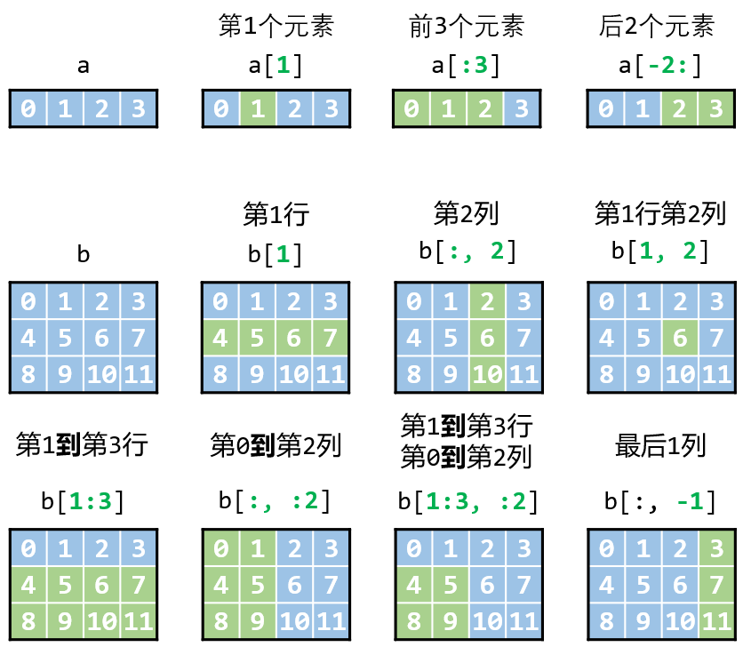

# 画学numpy

:rainbow:drawing and studying numpy

这个教程面对的是有一定python基础的numpy初学者。

这个教程对标numpy的[快速上手教程(英文)](https://numpy.org/doc/stable/user/quickstart.html)，中文版[点这里](https://www.numpy.org.cn/user/quickstart.html)

## 这个教程的写作风格:watermelon:

学习总是枯燥无味的，本教程希望能够在大家学习的过程中增添一些色彩，采用了丰富的插图让学习曲线更平滑的同时，记忆也更加深刻。

:last_quarter_moon:人的大脑在学习的过程中，左脑偏向于逻辑思维和记忆，右脑偏向于想象、联想。

因此适当的图像有助于读者更加有效地利用右脑，更高效地学习。

:blue_book:同时，本教程聚焦重点，介绍的都是工作会学习中最常用到的入门知识，兼顾实用性的同时大大降低了难度。

:orange_book: 本教程包含5个章节，总共超过50张插图。比如：




在学习其他优秀作者的文章时，我经常会遇到一些很赞的图片，有时候我会想，如果能这样修改一下这张图会更好，但可惜的是，大多数图片是不能修改的，由于没有源文件我得自己重新绘制。

:pushpin:为了让大家更好地利用这些插图，我把**绘制每张插图的文件都共享出来了**，就放在`images`文件夹里：

- 大部分插图是用PPT绘制的，参考`draw.pptx`文件
- 章节开头和结尾的思维导图请参考`.xmind`结尾的文件。

我就当抛钻引玉啦，相信大家可以画出更优秀的插图。


:balloon:当然，由于是入门性质的教程，自然是省略了许多复杂的概念，因此只学这个教程是不够地。

不过相信这个教程也能让初学者的各位少走许多弯路，因为我在刚开始学习numpy的时候也遇到了许多复杂的概念，但其实这些概念在一开始学习时不用深究，在使用numpy一段时间后再了解即可。

## 这个教程的目录:books:

[1.numpy数组初识](./1.numpy数组初识.md)

[2.numpy数组创建](./2.numpy数组创建.md)

[3.numpy数组操作](./3.numpy数组操作.md)

[4.numpy数组索引](./4.numpy数组索引.md)

[5.numpy数组运算](./5.numpy数组运算.md)

## 学习环境:earth_asia: 

本教程是在Jupyter Notebook中编写的，所有代码都测试通过。

所有markdown文件都是通过notebook文件转换而成的。

截止至2022年3月23日，使用的版本是[numpy 1.22.3](https://numpy.org/)

对于notebook转markdown，我自己写了个小程序（其实jupyter也有官方的转markdown工具，我是为了了解学习notebook文件结构自己写的一个工具）

使用方法，将`nb2md.py`文件拷贝到`.ipynb`文件目录下，运行

```
python nb2md.py
```

如果不想在自己电脑折腾python环境的同学也可以使用百度的AI Stuio平台

我把所有notebook文件都放在上面了，可以直接运行。

https://aistudio.baidu.com/aistudio/projectdetail/3669389

:rainbow:CSDN博客链接：

- [【画学numpy】介绍](https://blog.csdn.net/Light2077/article/details/123676075)
- [【画学numpy】1.numpy数组初识](https://blog.csdn.net/Light2077/article/details/123676012)
- [【画学numpy】2.numpy数组创建](https://blog.csdn.net/Light2077/article/details/123676032)
- [【画学numpy】3.numpy数组操作](https://blog.csdn.net/Light2077/article/details/123676048)
- [【画学numpy】4.numpy数组索引](https://blog.csdn.net/Light2077/article/details/123676059)
- [【画学numpy】5.numpy数组运算](https://blog.csdn.net/Light2077/article/details/123676066)
